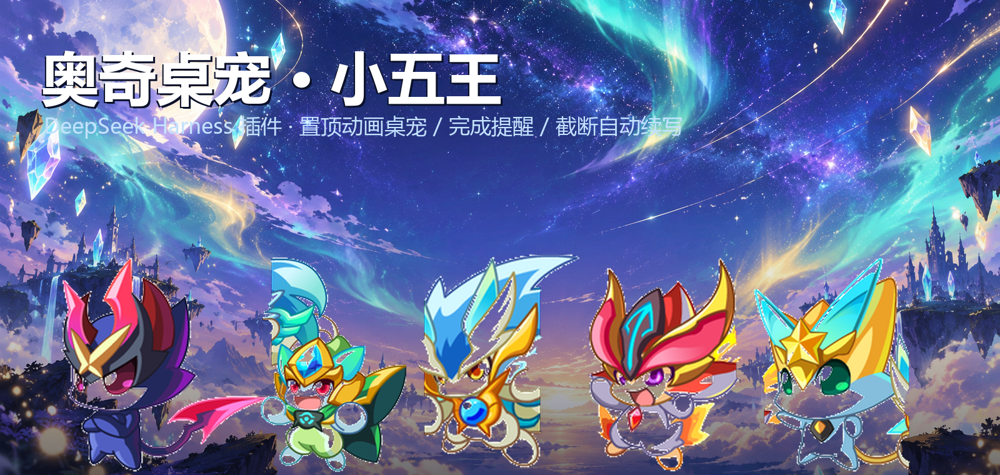
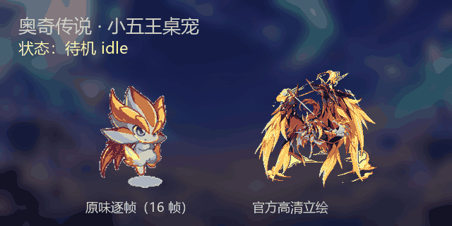

<div align="center">



# 奥奇桌宠 · 小五王 · dsh-aoqi-pet

**给 DeepSeek Harness 装一只奥奇桌宠：桌面上的它会掉下来、能被你甩出去撞边框，DSH 输入框旁边还有一只同步的小的；干活时它在动，干完活它喊你，输出被截断它自动接着写。**

`DeepSeek Harness 插件` · `Python 3 · tkinter（零第三方依赖）` · `Windows` · `MIT`

**动态演示**（下面这张 GIF 就是仓库里的素材帧，左边是原味逐帧、右边是官方高清立绘，同屏走完 5 种状态）：



</div>

---

## 为什么需要它

用 DeepSeek Harness 干长活时有两件事很烦：

1. **把窗口最小化去忙别的，它干完了你不知道**。DSH 自身没有软件外的提醒通道。
2. **输出撞到最大 token 数会被硬截断**，回合直接结束，模型不会自己接着写——你得盯回来手动发一句「继续」。

这个插件把这两件事都解决掉，顺便让桌面上多一只会动的小五王。

> **口径**：本项目只针对《奥奇传说》**页游**（百田，`aoqi.100bt.com`），不用手游资源；
> 宠物名称以页游官方「精灵大全」为准（考证过程见 [docs/NAMES.md](docs/NAMES.md)）。

## 它能做什么

| 能力 | 说明 |
| --- | --- |
| 🐾 **跳出软件的桌宠** | 独立进程 + 置顶透明窗口，**DSH 最小化时依然可见**，可以在桌面上拖动、不会被聊天窗口盖住 |
| 🪂 **重力 + 甩动 + 撞边框** | 重力常开、宠物常态待在屏幕下方；**拎起来往外甩**会带着惯性飞出去、撞到屏幕边框会弹（火花 + 抖动），最后被重力拉回下方停稳。实测甩出峰值 9084px/s、撞过 right/bottom/left 三边。见 [docs/PHYSICS.md](docs/PHYSICS.md) |
| 🖥️ **也活在 DSH 界面里** | 输入框旁边挂一只**同状态源**的小宠物（`conversation.composer.dock`）：跟着显示待机/干活/完成/出错/等你 + 回合统计，**点一下就换下一只五王**，桌面那只同步换人。见 [docs/IN-APP-UI.md](docs/IN-APP-UI.md) |
| 🎞️ **真·动画，不是静态贴图** | 传说五王（页游官方名）：龙炎 / 诺亚 / 帝释天 / 修尔 / 阿瑞斯 —— 你给的素材是它们的**初始形态**小炎 / 小诺 / 小天 / 阿修 / 阿瑞；每只 **16 帧**，派生 5 种状态动画（待机 / 工作 / 完成 / 出错 / 等待） |
| 🖼️ **两套素材随时切** | 右键「素材用官方高清立绘」：**页游官网图鉴立绘 370×344 降采样**（清晰）↔ 你给的 **原味 16 帧逐帧动画**（Q 版可爱）。见 [docs/HIRES.md](docs/HIRES.md) |
| 🪟 **可收起为静态图标** | 右键「收起为图标（静态）」→ 只留一枚**页游官方 logo 做的圆角图标** + 状态点（灰/青/绿/红/橙），不播动画、只占 78×78；展开锚定右下角，状态写回配置 |
| 💬 **实时进度气泡** | 「正在使用 edit…」「正在努力中…」「这一回合完成啦！」——看一眼桌宠就知道跑到哪了 |
| 🔔 **完成 / 出错 / 等待提醒** | 桌宠跳跃 + 气泡 + 可选 Windows 系统通知 + 提示音（可用右键静音） |
| ♻️ **截断自动续写** | 检测 `reason: max-tokens` 的回合结束，自动补发「继续」，带**宽限期 / 冷却 / 连击上限**三重防死循环 |
| 🛠️ **让模型主动汇报** | 内置 `aoqi_pet_say` / `aoqi_pet_status` / `aoqi_pet_switch` 三个工具，长任务的关键节点由模型自己捅一下桌宠 |
| 🌐 **可选状态接口** | 注册 `GET /api/aoqi-pet` 读状态、`POST /api/aoqi-pet?action=next-pet\|poke` 做动作（应用内小宠物就是靠它） |
| 📦 **零依赖零构建** | 宿主面不 import 任何 `@deepseek-ai/*`；客户端面是手写的 `window.__ModuleLoader__` bundle，不需要 npm 安装、不需要打包工具 |

## 架构：为什么桌宠必须是另一个进程

DSH 桌面端的宿主是 **Node 模式的宿主进程**，而 `Tray` / `Notification` / `BrowserWindow` 这些能力**只存在于桌面壳自己的 Electron 主进程**里 —— 插件跑在 profile/agent 这一侧，取不到 `electron` 模块（字节级核对：`app.asar` 里 `new Tray` 与 `new Notification` 各只有 1 处，都在壳的 `DesktopTray` 与更新提醒里；`require('electron')` 0 处）。所以**插件开不了窗口、也弹不了系统通知**。核对方法与全部数字见 [docs/CONVENTIONS.md](docs/CONVENTIONS.md) 第 4 节。

于是分成两边，中间用一个文件桥连接（这也正是「宠物要跳脱到软件之外」的技术必然）：

```
┌─────────────────────────── DeepSeek Harness（宿主进程，插件在这里）───────────────────────────┐
│  lib/index.js        session/event · agent/* 事件 → 状态机（idle/working/done/error/waiting）  │
│                      max-tokens 检测 → 宽限期 → agents.get(id).followup({ role:'user', ... })  │
│  lib/auto-continue.js 纯逻辑：要不要续写 / 冷却 / 连击上限（可单测）                            │
│  lib/bridge.js        写状态、读设置、读指令、写日志                                            │
│  lib/pet-runtime.js   找 Python（含 DSH 自带运行时）→ 拉起/守护桌宠进程 → 发系统通知            │
│  lib/client.js        客户端面（浏览器 bundle）：输入框旁的小宠物 + 工具结果卡片               │
│  tools                 aoqi_pet_say / aoqi_pet_status / aoqi_pet_switch                        │
└───────────────────────────────────────────┬──────────────────────────────────────────────────┘
        ▲ GET /api/aoqi-pet（DSH 界面内的小宠物轮询同一份状态）
        │                                   │ 文件桥（<DSH_HOME>/aoqi-pet/）
        │               state.json ◀────────┴────────▶ companion-settings.json / command.json
        │                                   │
┌───────┴───────────────────────────────────┴──────────────────────────────────────────────────┐
│  companion/aoqi_pet.py   独立 Python + tkinter 进程：置顶 + 透明 + 拖拽 + 重力/甩动/撞边框 +   │
│                          右键菜单 + 动画循环                                                  │
│  companion/petphysics.py 物理体（纯数学、无 tkinter 依赖、可单测）                            │
│  companion/toast.ps1     纯 ASCII 的 WinForms 气泡通知                                        │
└──────────────────────────────────────────────────────────────────────────────────────────────┘
```

* `state.json`：宿主每秒刷新，写清宠物、动画、气泡、会话、统计。桌宠窗口 200ms 轮询它。
* `companion-settings.json`：桌宠窗口是主要写者（换宠物/静音/暂停自动续写/位置），宿主只读——**右键菜单点一下就生效，不用改配置**。
* `command.json`：桌宠 → 宿主的一次性指令（点一下宠物＝解除自动续写封顶）。
* 宿主每 1 秒 `ensure()` 一次：**桌宠被关掉/崩了会自动重新拉起**；`state.json` 长时间不更新时桌宠自己退出（DSH 关了它不会变孤儿）。

## 安装

### 方式 A：插件管理器（推荐）

在 DSH 的**侧边栏 → 插件**页安装，或直接命令行（`<spec>` 支持注册表包名、**绝对路径**、git 地址、tarball；相对路径会被拒绝）：

```bash
# 发布到 registry 之后
dsh plugin add dsh-aoqi-pet

# 直接从这个 GitHub 仓库安装
dsh plugin add github:<你的用户名>/dsh-aoqi-pet

# 本地目录（必须是绝对路径）
dsh plugin add D:\Desktop\dsh-aoqi-pet
```

插件声明了 `dsh.bundle.patch`，安装后会被当作 profile 的**组合包**默认启用；`cordis.patch.yml` 里开着 HMR 时，**宿主面**（`lib/index.js` 的事件接线、工具、路由）会热加载。
但**客户端面**（`lib/client.js`，输入框旁边那只小宠物）是**启动时组装**的：安装完请**重启一次 DSH** 才会加载；
之后刷新页面**不会**重读磁盘上的 bundle（宿主已把字节 snapshot 下来了）。详见 [docs/IN-APP-UI.md](docs/IN-APP-UI.md) 第 3–4 节。

### 方式 B：手动挂载（不想用包管理器时）

1. 把整个 `dsh-aoqi-pet` 目录放到任意位置（例如 `D:\Desktop\dsh-aoqi-pet`）；
2. 在 profile 的 `cordis.patch.yml`（`<DSH_HOME>/profiles/<profile>/cordis.patch.yml`）末尾追加：

```yaml
- insert:
    - id: aoqi-pet                     # 必须全局唯一，重复会报 duplicate loader entry id
      name: "D:/Desktop/dsh-aoqi-pet/lib/index.js"   # 绝对路径，正斜杠最稳
      config:
        petId: shui
```

3. 保存即热加载（没开 HMR 就重启 DSH）。

> 两种方式都行，因为插件**零依赖**：不 import 任何 `@deepseek-ai/*`，也不要求自己位于 profile 的 `node_modules` 解析链上。（这也是它不需要声明 `peerDependencies` 的原因——兼容性预检因此永远通过。）

### 运行前提

只要有 **Python 3 + tkinter** 就能开窗：

* 优先用 **DSH 自带的 Python 运行时**（`<DSH_HOME>/dsh-runtimes/*/dependencies/python/python.exe`，带 tkinter，插件会自动找到它）；
* 找不到就用 `config.companion.pythonPath` 指定绝对路径，或用 `DSH_AOQI_PYTHON` 环境变量。

### 卸载

```bash
dsh plugin remove dsh-aoqi-pet     # 管理器路线
```

手动挂载的：删掉上面那段 `insert` 行即可；再顺手删掉 `<DSH_HOME>/aoqi-pet/` 状态目录。想连桌宠进程一起收掉，把 `companion.killOnUnload` 设为 `true`。

## 配置

写在插件行的 `config:` 下（部分键可被桌宠右键菜单即时覆盖）：

| 键 | 默认 | 说明 |
| --- | --- | --- |
| `enabled` | `true` | 总开关 |
| `petId` | `shui` | 初始宠物（真名见 [docs/NAMES.md](docs/NAMES.md)）：`huo` 龙炎 / `jin` 诺亚 / `shui` 帝释天 / `an` 修尔 / `mu` 阿瑞斯 |
| `companion.material` | `auto` | 素材偏好：`auto`（有官方高清就用）/ `hires`（只用官方高清）/ `frames`（只用原味逐帧），右键菜单可即时切换 |
| `companion.autoLaunch` | `true` | 插件加载后自动拉起桌宠进程 |
| `companion.pythonPath` | `''` | 指定 Python 解释器；空＝自动探测 |
| `companion.scale` | `1` | 桌宠缩放（<1 用整数降采样） |
| `companion.opacity` | `0.97` | 窗口不透明度 |
| `companion.alwaysOnTop` | `true` | 置顶 |
| `companion.sound` | `true` | 完成/出错的提示音 |
| `companion.balloonTips` | `true` | Windows 系统气泡通知 |
| `companion.staleExitMs` | `120000` | 宿主状态文件多久不更新，桌宠自杀（防孤儿进程） |
| `companion.killOnUnload` | `false` | 插件卸载时是否顺手杀掉桌宠 |
| `autoContinue.enabled` | `true` | 截断自动续写总开关 |
| `autoContinue.continueText` | `继续输出，不要重复已经生成的内容。` | 截断时补发的话 |
| `autoContinue.stallText` | `请接着上一个回合继续，把结论补完整。` | 空转时的补发话术 |
| `autoContinue.graceMs` | `3000` | 宽限期：这段时间内宿主自己开了新回合/用户说了话就**取消**续写 |
| `autoContinue.cooldownMs` | `8000` | 两次自动续写的最小间隔 |
| `autoContinue.maxConsecutive` | `3` | 连击上限，达到后暂停并提醒 |
| `autoContinue.detectStalled` | `true` | 同时处理「回合结束但没有任何可见输出」 |
| `notify.onComplete` / `onError` / `onTruncate` / `onWaiting` | `true` | 各类通知开关 |
| `notify.minTurnMs` | `4000` | 短于这个时长的回合不弹「完成」（避免刷屏） |

## 自动续写是怎么保证不乱来的

```
turn/end { reason: max-tokens }
        │
        ├─ 宽限期 graceMs=3s（桌宠气泡：输出被截断了，我帮你接着说～）
        │     ├─ 宿主自己开了新回合 / 用户说了话 / agent 已销毁 → 取消
        │     └─ 通过 → agents.get(sessionId).followup({ role:'user', content:[{type:'text',…}] })
        │
        ├─ 冷却 cooldownMs=8s：太频繁的截断不会连发
        ├─ 连击上限 maxConsecutive=3：到顶就停，气泡 + 系统通知提醒你
        └─ 任何真实用户消息 → 连击清零；点一下桌宠 / 右键「立即恢复自动续写」→ 解封重来
```

设计上的克制：**只在 `max-tokens`（以及可选的「回合结束但无可见输出」）时出手**，正常完成、用户取消、出错都不插嘴；每次决定都写进 `<DSH_HOME>/aoqi-pet/aoqi-pet.log`，事后可查。相关纯逻辑集中在 `lib/auto-continue.js`，`test/smoke.mjs` 覆盖了决策、限流与接线。

## 使用

* **右键桌宠**：换一只小五王 / **收起为图标（静态）** / 素材用官方高清立绘 / **甩动·撞击边框（重力常开）** / **失重实验（默认关）** / 静音 / 暂停自动续写 / 窗口置顶 / 回到默认位置 / 立即恢复自动续写 / 退出桌宠。
* **拖动 = 甩**：按住左键拖走，**松手时的速度会变成惯性** —— 甩得快就飞得远，撞到屏幕边框会弹（火花 + 抖动），然后被重力拉回下方停稳；位置自动记住（收起状态下的位置也会记住）。
* **重力常开**：宠物常态就在屏幕下方；「失重实验」是可选项，打开才会往上飘。
* **DSH 界面里也有它**：输入框旁边那只小宠物跟着同一份状态，显示待机/干活/完成/出错/等你 + 回合统计，**点一下就换下一只五王**（桌面那只同步换人，并冒泡提示）。
* **点一下**：展开状态下相当于「我看见了」——清零连击、解除封顶；**收起状态下点一下 = 展开回宠物**。
* **双击**：等同于点一下。
* **收起时**：只显示一枚圆角图标，右上角状态点实时反映状态（灰=待机 / 青=工作 / 绿=完成 / 红=出错 / 橙=等待），
  完成与出错照样弹气泡、响提示音、发系统通知——所以**收起也不耽误被提醒**。
* **让模型主动汇报**（长任务很有用）：`aoqi_pet_say`，参数 `text`（气泡文字）、`mood`（`idle`/`working`/`done`/`error`/`waiting`）。
* **查状态**：`aoqi_pet_status`（模型侧）或 `GET /api/aoqi-pet`（HTTP）。

## 目录结构

```
dsh-aoqi-pet/
├── lib/
│   ├── index.js          插件入口：事件接线、状态机、通知、三个工具、HTTP 路由（含应用内换宠）
│   ├── client.js         客户端面（浏览器 bundle，非 ESM，零构建）：输入框旁的小宠物 + 工具卡片
│   ├── auto-continue.js  自动续写决策（纯函数，可单测）
│   ├── bridge.js         文件桥：state/settings/command/log 读写
│   └── pet-runtime.js    找 Python、拉起并守护桌宠进程、系统气泡通知
├── companion/
│   ├── aoqi_pet.py       桌宠窗口：置顶透明动画、拖拽甩动、重力/碰撞、右键菜单、气泡、收起为图标
│   ├── petphysics.py     物理体：重力/失重/空气阻尼/四边反弹/睡眠（纯数学，可单测）
│   └── toast.ps1         WinForms 气泡通知（纯 ASCII，中文走 base64）
├── assets/
│   ├── pets/<id>/        base/f00..f15.png、5 个状态 GIF、portrait.png、hires/（官方高清素材 + source.png）
│   ├── pets/index.json   每只宠物的元数据与文件清单
│   ├── pets/names.json   五王真名与官方出处（图鉴链接、立绘 URL）
│   └── theme/            platform.png（生图站台，抠白底后用）、aoqi-icon.png（官方 logo，收起态）、*-raw.png（生图原图）
├── tools/                素材流水线：切片 / 合成动画 / 官方高清 / 抓取 / 文档演示图（可复现）
├── test/smoke.mjs        自包含冒烟测试（53 项断言，不装依赖）
├── test/client-ui.mjs    客户端面契约测试（34 项：假 __ModuleLoader__ + 假 React 真跑 bundle）
├── test/pet-physics.py   物理单测（13 项：重力/反弹/衰减/不穿墙/dt 无关性）
├── test/physics-live.py  物理真机验证（Win32 量真实窗口矩形：落下→落底、甩出→撞框→回底）
├── test/switch-guard.py  切换回归测试：隔离实例 + 钉死宿主状态，验证选择不被弹回
├── docs/                 头图、截图、验证记录、名称考证（NAMES.md）、高清素材（HIRES.md）、物理（PHYSICS.md）、界面内宠物（IN-APP-UI.md）、参考规范（CONVENTIONS.md）
├── cordis.patch.yml      组合包 patch：把插件行插进 profile
└── package.json          dsh.bundle.patch + dsh.client（客户端面）+ dsh.catalog 元数据
```

## 素材与版权

* **宠物素材**来自你提供的 `R.gif`（16 帧 idle 逐帧图）与 `R.png`：`tools/slice_pets.py` 切图去白底，`tools/make_anim.py` 合成 5 种状态 GIF。复现：

  ```bash
  python tools/slice_pets.py --src R.gif --atlas R.png --out assets/pets
  python tools/make_anim.py  --out assets/pets
  ```

* **官方高清素材**（`assets/pets/<id>/hires/`）来自**页游官网精灵图鉴立绘**（370×344 透明 PNG）：
  `tools/hires_build.py` 下载 → 内接缩放到 ≤196×190（**降采样**，所以锐利）→ 程序化动作生成 5 个状态 GIF。
  这只解决「放大糊」：源细节从约 122px 提到约 190px，重采样方向从放大改成缩小。
  取舍、实测数据与官方链接见 [docs/HIRES.md](docs/HIRES.md)。

  ```bash
  python tools/hires_build.py            # 下载官方立绘 + 生成 hires/{f00.png,5 个状态 GIF}
  python tools/hires_build.py --offline  # 只用本地已下载的 source.png
  ```

* **站台底座与 README 头图背景**由内置生图能力（`gpt-image-2.5-flare`）生成：站台抠白底成透明 `assets/theme/platform.png`（就画在宠物脚下，每一帧都在），极光原图作 `docs/hero.png` 的背景；`assets/theme/*-raw.png` 保留原图便于再加工。收起态用的 `aoqi-icon.png` 是官方 logo。
* **README 那张动态演示**（`docs/demo.gif`，25 帧 / 循环播放）由 `tools/make_doc_demo.py` 生成：背景就是上面那张**生图**极光原图（模糊压体积），前景是**仓库里真实的素材帧**（左 `frames`、右 `hires`），所以你在 README 里看到的就是桌宠实际会动成的样子。

  ```bash
  python tools/make_doc_demo.py --pet huo     # → docs/demo.gif（可用 --pet 换只宠物重做）
  ```
* **版权声明**：**《奥奇传说》及其角色形象版权归百田信息科技（百田/百奥家庭互动）所有**。本仓库是粉丝向技术演示，素材仅供**个人学习与本地使用，禁止商用、禁止二次分发为商业素材**；仓库中的 **MIT 许可只覆盖代码**（`lib/`、`companion/`、`tools/`、`test/`），不覆盖 `assets/` 下的美术资源。如果你是版权方并要求移除，请开 issue，我会立刻处理。
* 五只宠物的中文名不是自取的，而是**页游官方图鉴里的真名**：传说五王 = **龙炎 / 诺亚 / 帝释天 / 修尔 / 阿瑞斯**（诺雅是诺亚的妹妹，不在五王之列）。考证过程、官方链接、以及「哪只对应哪个名字」的逐项比对见 [docs/NAMES.md](docs/NAMES.md) 与 `assets/pets/names.json`。

## 验证

每个阶段都跑过真实验证，证据与命令见 [docs/VERIFICATION.md](docs/VERIFICATION.md)：

* **冒烟测试 53/53**（`node test/smoke.mjs`）：工具注册、事件→状态机、续写决策、真名/俗称切换、桌宠设置联动、`/api/aoqi-pet` 的 GET/POST 行为。
* **客户端面契约 34/34**（`node test/client-ui.mjs`）：在假 `__ModuleLoader__` + 假 React + 假 `ctx.slots` 上真跑一遍 `lib/client.js`，逐条断言非 ESM、零顶层副作用、只 require 平台模块、id 等于包名、slot 注册形状、渲染与点击换宠物。
* **物理单测 13/13**（`python test/pet-physics.py`）+ **物理真机 9/9**（`python test/physics-live.py`，连跑 3 次全绿）：自顶掉落→停在下方面（窗口底边 = 工作区底边）、合成甩动峰值约 9000px/s→撞 right/bottom/left→被重力拉回下方停稳。
* **切换回归测试 6/6**（`python test/switch-guard.py`）：自己起一个隔离桌宠实例、把宿主状态钉死在会触发回弹的值上，断言用户的选择不会被宿主状态覆盖；并做了**负向对照**（把旧逻辑装回去，同一测试 5/6 失败）证明它真的能抓 bug。
* 真实宿主热加载、桌宠进程自动拉起（1.5 秒重生）、窗口截图、相邻帧像素差、状态文件与 HTTP 路由读取。
* 官方高清素材 25 个 GIF 的帧数/时长/透明三重自检，三种素材偏好的加载实测。
* **参考与前提核对**：[docs/CONVENTIONS.md](docs/CONVENTIONS.md) —— 逐项列出参考了本 profile 里
  `plugins/image-generation/index.js` 的哪些接缝写法（裸 `ctx.tools.register` + `output.schema/render`、零依赖、`insert:` 挂载），
  以及 `app.asar` 的字节级扫描结果（Tray/Notification 只在 Electron 主进程里，插件侧取不到）。

## 常见问题

**桌宠没出现？**
1. 看 `<DSH_HOME>/aoqi-pet/aoqi-pet.log` 里的解释器探测与启动记录；
2. 没有 tkinter 就会拒绝开窗（这时换一个带 tkinter 的 Python，或用 DSH 自带运行时）；
3. 桌宠进程在，但看不见：可能在屏幕外——右键菜单「回到默认位置」，或删掉 `companion-settings.json` 让位置重算。

**系统通知不弹？** Windows 专注助手/勿扰会吞掉气泡通知；桌宠气泡和提示音不受影响。也可以直接关掉 `companion.balloonTips`。

**自动续写太积极/太保守？** 调 `autoContinue.maxConsecutive`（想无限就一直加）、`cooldownMs`；不想让它管就 `enabled: false`，或右键「暂停自动续写」（这个开关是持久的）。

**支持 macOS / Linux 吗？** 宿主侧跨平台，但桌宠窗口当前针对 **Windows**（`-transparentcolor`、`winsound`、`powershell.exe` 通知）。macOS 上把 `companion.autoLaunch` 设为 `false` 可以只用自动续写+工具，接自己的窗口实现。

## License

[MIT](LICENSE)（仅代码）。美术素材版权见上文「素材与版权」。
