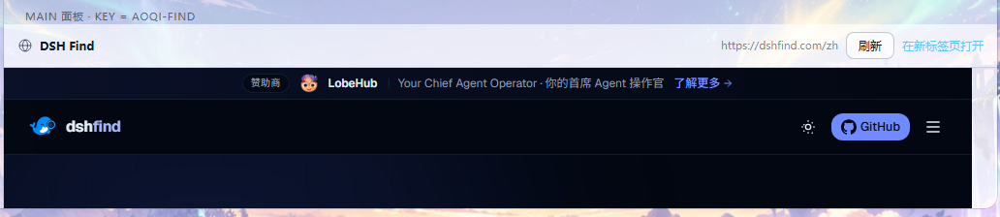

# 让宠物进入 DSH 界面（客户端面 / Client Face）

用户原话：「没有变动 DSH 软件内部的界面，没有参与进来。」
这一节就是那件事：在**输入框旁边**放一只跟着状态变的小宠物，点一下能换五王。
后来又加了两个东西（同一份 bundle、同一套 slot 契约）：**换肤**（侧栏「奥奇换肤」→ 皮肤中心，底图 + 半透明配色一起换）和
**内置网页面板**（侧栏「DSH Find」→ 主区域 iframe 打开 `https://dshfind.com/zh`）。换肤的设计与素材清单见 [SKINS.md](SKINS.md)，
可复现的验证记录见 [VERIFICATION.md](VERIFICATION.md) 第 20 节。

## 1. 为什么能这么做（都是 asar 里的原文，不是猜的）

DSH 有一套官方文档化的第三方客户端插件体系，`dsh-agent-preset` 里还自带模板
`skills/cordis-plugin-development/templates/decoration/`。关键结论：

| 结论 | 证据 |
|---|---|
| 客户端面由 `package.json` 的 `dsh.client` 声明 | `@deepseek-ai/dsh-client-modules/lib/index.js:64-72` |
| 浏览器入口 = `exports["./client"]` 指向的文件 | 同上 `:171-181` |
| `dsh.client.platform` 必须是 `"web"`，否则**整包被忽略** | 同上 `:714` |
| 客户端文件**不是 ESM**，是 `window.__ModuleLoader__.load({id, factory})` 懒加载包装 | `dsh-client-ui-brand-official/lib/client.js:1-3` |
| 导出 `{ apply(ctx), inject }`（cordis 插件形状） | 同上 `:42-44` |
| bundle 由宿主用 `/plugins/...` 路由 serve（不是 vite） | `dsh-client-modules/lib/index.js:201` |
| **本地路径挂载**也能有客户端面（只要目录里有带 `dsh.client` 的 package.json） | 同上 `:743-790` |
| 必须在启动前把 `lib/client.js` 落盘，否则激活期抛 `MissingClientBundleError` | 同上 `:132-146` |
| 平台只提供 9 个模块：`react` / `react/jsx-runtime` / `react-dom` / `react-dom/client` / `@deepseek-ai/cordis` / `dsh-client-store` / `dsh-client-ui-slots` / `dsh-client-ui-primitives` / `dsh-client-ui-dockkit` | `dsh-web-frontend/dist/assets/index-5SrrfWpU.js` @628285 |
| 可用 slot 共 90 个；我们选了官方点名的 `conversation.composer.dock`（list/session） | `dsh-client-ui-conversation/lib/client.js:18329` |

⇒ **不需要 npm 发布、不需要构建工具、零依赖**：一个手写的 `lib/client.js` 就行。
宿主面（`lib/index.js`）一行都不用为了客户端面改动 —— 官方 `dsh-client-ui-brand-official` 的宿主半边就是空壳。

这一轮新增的两个入口（侧栏「奥奇换肤」「DSH Find」+ 两个主面板）用的是 `sidebar.panellist` 与 `main` 两个席位，
和 `conversation.composer.dock` 走**同一套 `ctx.slots` 契约**（list 给 `id`/`order`、keyed 给 `key`）。
这两个席位的名字与字段**是在 asar 里的官方 bundle 上核对过的**，不是照我们自己的代码猜的：

* `@deepseek-ai/dsh-client-ui-sidebar/lib/client.js`
  * 席位声明：`"sidebar.panellist": { kind: "list", scope: "root" }`；
  * `syncPanels()` 就是读 `options.id` / `options.order ?? 0` / `resolveSlotLabel(options.label) ?? id` 并按 `order` 排序；
  * 渲染时 `renderSlot("sidebar.panellist", { size: wide ? 16 : 18, active }, { only: id })`，点击调 `selectPanel(id)`。
* `@deepseek-ai/dsh-client-ui-layout/lib/client.js`
  * 席位声明：`"main": { kind: "keyed", scope: "root" }`，渲染 `renderSlot("main", {}, { entryKey: activePanelId ?? "conversation" })`；
  * 而 `selectPanel(panelId)` 里有一句
    `if (panelId !== null && !this.hasMainPanel(panelId)) throw new Error('layout.selectPanel: main panel "…" is not registered')`
    —— **只注册侧栏入口、没有同名 `main` 面板，点一下就会抛错**。这正是我们必须成对注册（`id` 与 `key` 一一对应）的原因，
    也是 `test/client-ui.mjs` 里专门断言两者相等的原因。

还有一层是**运行时**：席位与字段是契约层面核实过的（官方 bundle 的源码就摆在那儿），
插件本身也**确实被挂载并在跑**（在跑的 GUI 上 `/api/aoqi-pet` 返回 200、`state.json` 每秒刷新）；
剩下没验的只有「新版客户端 bundle 装进宿主之后，这两个入口在真界面上画出来的样子」——
那需要**装新版 + 重启 DSH**，见第 3 节。

## 2. 我们做了什么

### 2.1 `lib/client.js`（浏览器 bundle）

* 格式：`window.__ModuleLoader__.load({ id: 'dsh-aoqi-pet', factory(require) {...} })`，
  **文件执行时零副作用**（样式表也是在 `apply` 里用 `ctx.effect` 注册、并返回清理函数）。
* 只 `require('react')`，不 require 任何 `@deepseek-ai/dsh-client-*`（官方 practices.md 明确要求）。
* 注册四处（前两处是老席位，没动；后两处是这一轮加的）：
  * `conversation.composer.dock`（**list** slot ⇒ 必须给 `id` 与 `order`，`id: 'aoqi-pet'`，`order: 50`）→ 输入框旁的圆角小条：
    一只 SVG 小宠物 + 宠物名 + 状态 + 「回合/完成/续写」统计。
  * `tool.call.toolview`（**keyed** slot ⇒ 必须给 `key`）→ 把 `aoqi_pet_status` 的结果渲染成同样的宠物卡片。
  * `sidebar.panellist` × 2（**list** slot）→ 左侧栏入口，和「插件」「自动化任务」同一列：
    `id: 'aoqi-skins'`、`label: '奥奇换肤'`、`order: 60`；`id: 'aoqi-find'`、`label: 'DSH Find'`、`order: 61`。
  * `main` × 2（**keyed** slot）→ 上面两个入口点开后的主面板正文，`key` **必须等于**对应入口的 `id`
    （`aoqi-skins` → 皮肤中心，`aoqi-find` → 内置网页）。
* **换肤引擎**（常驻，和 dock 的 1.5s 轮询**分开**，它是 3 秒一拍 `GET /api/aoqi-pet`）：
  把快照里的 `skin` 应用成「`<html>` 上的三层底图变量 + 一层 token 覆盖」——底图挂 `<html>` 并加 `data-aoqi-skin="<id>"`，
  配色走官方 `ctx.get('theme').overrideTokens('dsh-aoqi-pet/skin', tokens)`；**拿不到 theme 服务时**退化成直接往
  `body.style` 写同样的变量（效果一致，只是少了官方的分层语义）；并订阅 `theme/change`，明暗切换时重画。
* **内置网页面板**：工具条（标题 + 地址 + 刷新 + 在新标签页打开）+ 一个 iframe，`sandbox` 为
  `allow-scripts allow-same-origin allow-forms allow-popups allow-popups-to-escape-sandbox allow-downloads` ——
  故意**不加** `allow-top-navigation`，内嵌页面就没法把 DSH 自己导航走。
* 视觉只用主题 token（`--dsw-alias-*`），所以跟随明暗主题，不写死颜色。
* 动画用 CSS keyframes（`prefers-reduced-motion` 下自动关闭）。

### 2.2 状态来源：和桌面那只桌宠**同一份**

客户端不自己造状态，它轮询宿主插件已经注册的路由（小宠物 1.5s，换肤引擎 3s）：

```
GET  /api/aoqi-pet                     → { ok, state, pets, skin:{enabled,id,scrim,catalog}, find:{enabled,title,url}, files }
GET  /api/aoqi-pet/skins               → 只要皮肤目录
GET  /api/aoqi-pet/skin/<id>[/thumb]   → 底图二进制（content-type / content-length / cache-control: public, max-age=3600）
POST /api/aoqi-pet?action=next-pet     → 轮换下一只五王（写 companion-settings.json，桌面桌宠跟着换）
POST /api/aoqi-pet?action=poke         → 桌宠冒泡「我在这儿！」
POST /api/aoqi-pet?action=set-skin&id=<皮肤 id>&scrim=<0..1>  → 换肤（写 skins.json；认不出的 id 返 404，不会把界面换坏）
```

底图**不塞进 JSON**：一张场景图是 MB 级，塞进每 3 秒一次的快照里会直接拖垮界面，所以单独走二进制路由 + 让浏览器缓存一小时。

所以「应用内的小宠物」和「屏幕上的桌宠」永远一致：点一下应用内的小条，桌面那只真的会换人。
（`state` 就是宿主写进 `~/.dsh/aoqi-pet/state.json` 的那一份：动画、气泡、统计、自动续写状态。）
换肤的选择则是第三份文件 `~/.dsh/aoqi-pet/skins.json`（`{id, scrim, updatedAt}`），界面侧与模型工具都写它。

## 3. 怎么看到它

**先把一个反直觉的事实说清楚（这里我判断错过一次，记下来免得再踩）**：桌面 profile 的 `cordis.patch.yml`
（`<DSH_HOME>/profiles/desktop/cordis.patch.yml`，**patch 层**）里确实**只有** `image-generation` 一条 `insert`、
**没有** `aoqi-pet`，但这**不代表插件没挂载**。`<DSH_HOME>/profiles/desktop/package.json` 的
`dsh.profile.bundles` 里列着 `dsh-aoqi-pet`，于是本包自己的 `dsh.bundle.patch`（仓库根目录那份 `cordis.patch.yml`，
里面就写着 `insert: - id: aoqi-pet`）会作为 **bundle 层**自动生效。
**所以 patch 层不需要、也不应该再补一行 insert** —— 同一个 loader entry id 出现两次，加载会直接失败。

实测印证这一点：在跑的 GUI 上 `curl http://127.0.0.1:19387/api/aoqi-pet` 返回 **200**，
且 `~/.dsh/aoqi-pet/state.json` 每秒都在被刷新（宿主插件确实在跑，只是跑的是旧版）。

**所以要看到这一轮的新功能，只有两步**：

1. **装/更新到这一版**：用插件管理器从 GitHub 装（`dsh plugin add github:<user>/<repo>`），或更新已有安装；
2. **重启 DSH**（不是刷新页面）：客户端 bundle 在启动时被 snapshot 进宿主，刷新**不会**重读磁盘上的 bundle。
   宿主面（工具、`/api/aoqi-pet` 路由）开着 HMR 会热加载，但**换肤引擎、两个侧栏入口、主面板都在客户端面**，必须重启。

重启后打开任意会话，应当看到四处：输入框旁边那只小宠物（点它换五王）、左侧栏「奥奇换肤」与「DSH Find」两个入口，
以及点开后的皮肤中心（卡片网格 + 压暗层滑杆）与内置网页（iframe 里的 `https://dshfind.com/zh`）。

## 4. 验证到什么程度（诚实分界）

**已经用自动化验证的**（`node test/client-ui.mjs`，62 项全过，不需要 DSH/浏览器/构建工具）：

* `dsh.client.platform === "web"`、`exports["./client"]` 指向真实文件；
* bundle 不是 ESM、无顶层副作用、只 require 平台模块、不 require 业务组件包；
* 在假 `__ModuleLoader__` + 假 React + 假 `ctx.slots` 上真跑一遍：注册的 `id` 等于包名、
  `factory` 返回 `{inject:['slots'], apply}`、六处注册的参数形状正确（三处 list 都有 id/order、三处 keyed 都有 key）、
  两个 `main` 的 `key` 与两个 `sidebar.panellist` 的 `id` **一一对应**、
  样式作为资源注册且清理函数真的删掉 DOM 节点；
* 组件能渲染出宠物名/状态/统计，拉到状态后更新，`onClick` 走 `POST ...?action=next-pet`；
* 工具卡片拿到文本渲染第一行、拿不到结果时返回 `null`（不破坏别人的卡片）；
* **换肤真的作用到 DOM 上**：`<html data-aoqi-skin="aurora">`、底图变量指向 `/api/aoqi-pet/skin/<id>`、
  压暗层是现场拼的渐变、尺寸/位置来自目录（立绘是 `auto 86%` + `right bottom`）、
  覆盖层走的是官方 `ctx.theme.overrideTokens`（source = `dsh-aoqi-pet/skin`）且给的是 `{light, dark}` 成对值、
  点卡片立刻换底图并 POST `set-skin`、订阅了 `theme/change`；
* **降级路径**（宿主没提供 theme 服务时）：底图照样铺上、token 改成直接写 `body.style`、按当前色系挑浅色那套、全程不抛异常；
* **网页面板**：渲染出标题与地址、里面是一个真的 iframe、`src` 等于宿主配置里的地址、`sandbox` 含 `allow-scripts` 且**不含** `allow-top-navigation`。

**配套的宿主侧验证**（`node test/smoke.mjs`，75 项）：`GET` 返回 `state/pets/files` 与 `no-store`、
`POST next-pet` 真的轮换并写设置文件（`an → mu`）、`POST poke` 冒泡、未知 action 返回 400 不崩；
换肤这一段另有 22 项：目录字段完整性、底图二进制**字节数与磁盘上的文件一致**、`cache-control` 带 `max-age=3600`、
未知皮肤与路径穿越都返 404、`GET /skins` 单独给目录、`POST set-skin` 落盘到 `skins.json`、`aoqi_pet_skin` 的 `list`/`apply`/`off` 三个 action。

### 4.1 它长什么样（本地 harness 渲染）

输入框旁的小宠物（亮色 / 暗色 / 工具卡片），1000×430：


换肤与内置网页（1320×900，图里那个 iframe 是**真的** dshfind.com）：


换成龙炎立绘（立绘在右下半透明面板后面，1320×900）：


网页面板那张是从 `skins-preview.png` 里**裁**出来的（1032×224）—— 不单独拍，是因为只渲染网页面板时无头 Chromium 容易拍到 iframe 还没画完的一帧：



复跑：

```bash
node test/client-ui.mjs                  # 契约测试（62 项）
pwsh -File tools/shoot_client_ui.ps1     # 用无头 Edge 渲染 test/client-ui-preview.html → docs/in-app-dock.png
# 换肤 / 网页面板：查询串选皮肤、只留应用外壳；等外网资源要加 -VirtualTimeMs（页面必须带 once=1）
pwsh -File tools/shoot_client_ui.ps1 -Query "skin=aurora&once=1&only=app" -Out docs\skins-preview.png -Width 1320 -Height 900
pwsh -File tools/shoot_client_ui.ps1 -Query "skin=huo&once=1&only=app" -VirtualTimeMs 15000 -Out docs\skins-preview-king.png -Width 1320 -Height 900
# 或 npm run preview:client
```

页面 `test/client-ui-preview.html` 支持的查询串：`?skin=<id>&once=1&only=app&panel=find|skins`
（`once=1` 把轮询降级成只拉一次、`only=app` 只留应用外壳、`panel=` 只渲染某一个主面板）。

这几张图都是 **harness 渲染**，不是 DSH 里的截图 —— 页面顶部那条红字就是标注，避免被误当成真机界面。
它同样有真东西：**真 Chromium** + 仓库里**同一份 `lib/client.js`**（通过一个假的 `window.__ModuleLoader__`），
所以它验证的是「组件代码 + 主题 token + SVG 在明暗两套主题下渲染正常」，现在还包括「换肤的三层底图变量 + token 覆盖层」。
React 用的是等价 shim（`createElement` / `useState` / `useEffect` / `useRef` + 极简 DOM 渲染器），
因为不重启 DSH 就没法把 bundle 交给真的模块加载器。

`tools/shoot_client_ui.ps1` 里记了几个坑（完整复现步骤见 [VERIFICATION.md](VERIFICATION.md) 第 20 节）：
**别在还有轮询的页面上加 `--virtual-time-budget`**（定时器会让无头 Chromium 永不退出，实测挂死；脚本现在只在查询串带 `once=1` 时才允许 `-VirtualTimeMs`）、
清理时**只杀 `--headless` 的主进程**（按名字杀 `msedge.exe` 会把你自己开着的浏览器一起关掉）、
脚本必须存成 **UTF-8 with BOM**（否则 Windows PowerShell 5.1 按 GBK 解码中文注释，脚本会被解析坏）、
`--screenshot` 的值**含空格必须加引号**（否则浏览器报 "Multiple targets are not supported in headless mode"、退出码 13）。

**还没验证的（写清楚，不含糊）**：

* **界面里真的出现的样子**：需要 DSH 重启加载 bundle，我没法在不重启的前提下截图核实 ——
  落地后请自己看一眼（输入框旁边那只小宠物、左侧栏「奥奇换肤」「DSH Find」两个入口）。前提是插件已经**挂载**：见第 3 节的当前状态。
* **`sidebar.panellist` / `main` 这两个席位在宿主里的真实声明**：这一轮**没有**重扫 asar 取证（上一轮取证的是
  `conversation.composer.dock` / `tool.call.toolview`），席位名照 `lib/client.js` 头部的挂载点表写；自动化测试只断言注册形状，**不**断言席位存在。
* **第三方场景下改 `lib/client.js` 靠「重装」还是「重启」生效**：官方 HMR 的 watcher 由 DSH 源码
  checkout 的 `pnpm run dev:web` 提供，第三方仓库没有这个脚本，**未确证**。稳妥做法：改完重启 DSH。
* **`conversation.composer.dock` 的真实 props 契约**没读到（文档标了未确证），所以组件**不依赖任何 props**，
  只靠自己 fetch —— 即使宿主传了新字段也不会崩。
* **`dshfind.com` 的第三方可变性**：能内嵌是因为它当前**没有**发 `X-Frame-Options`、**也没有** CSP `frame-ancestors`
  （实测见 [VERIFICATION.md](VERIFICATION.md) 第 20 节）；哪天站点加上这两个头，这个面板就会白屏，那时只能改成「新标签页打开」。
* 若宿主版本里没有 `conversation.composer.dock`、`tool.call.toolview`、`sidebar.panellist` 或 `main` 声明，
  往未声明的 slot 注册会在加载期抛错；那时应当把对应那一段 `ctx.slots.inject(...)` 注释掉（四处互不影响）。
