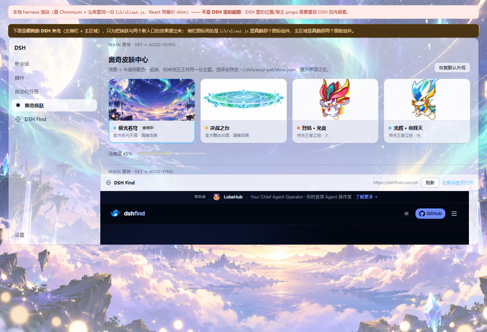
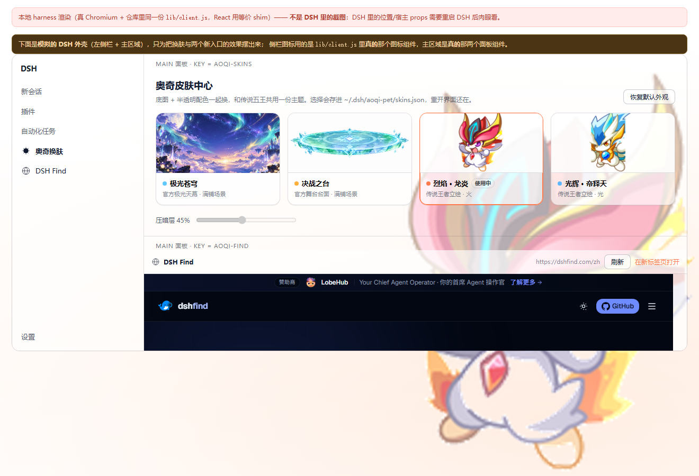

# 换肤：把整个界面铺上奥奇传说

一句话：**换肤 = 一层底图 + 一次 token 覆盖**。底图挂在 `<html>` 上，token 覆盖把 DSH 自己的面板色换成半透明的奥奇配色，于是侧栏、输入框、卡片一起变成「玻璃板」，底图就透出来了。

界面里长这样（本地渲染 harness，真 Chromium 跑的同一份 `lib/client.js`，内置网页里是**真的** dshfind.com）：



换成王者立绘（立绘在右下半透明面板后面）：



---

## 1. 为什么必须是「底图 + token 覆盖」，不能直接改 CSS

DSH 的界面颜色全部走 `--dsw-alias-*` 这批 token：token 由 `dsh-client-ui-theme` 持有，由 `dsh-client-ui-layout` 以 **inline style** 写在 `body` 上（`body.style.setProperty(name, value)`），第三方样式表里的同名单声明大概率被 inline 盖掉。

所以插件只有两条路：

| 做法 | 结论 |
| --- | --- |
| 自己在样式表里重定义 `--dsw-alias-*` | ❌ 打不过 body 上的 inline style，而且会污染别人 |
| 调官方接口 `ctx.get('theme').overrideTokens(source, tokens)` 叠一层 | ✅ 官方支持的分层覆盖，可撤销、可叠加、不打架 |

拿不到 theme 服务时（宿主版本变了、服务还没起来）自动退化成「直接往 `body.style` 写同样的变量」，效果一致，只是少了官方的分层语义。

> 覆盖层的值必须写成 `{ token: { light, dark } }` 的**成对值**，直接给字符串会被官方的校验抛 `TypeError`。

## 2. 一套皮肤由什么组成

`lib/skins.js` 的目录条目就是全部描述，客户端面照着执行，没有第二处硬编码：

| 字段 | 作用 |
| --- | --- |
| `id` / `name` / `subtitle` | 皮肤中心卡片上的文字；`id` 同时是 `data-aoqi-skin` 的值和路由参数 |
| `kind` | `scene`（场景图满铺）或 `king`（五王立绘贴右下） |
| `accent` | 卡片上的小圆点、品牌色（`--dsw-alias-brand-primary`） |
| `image` | `/api/aoqi-pet/skin/<id>`，客户端拿它当 `background-image` |
| `imageSize` / `imagePosition` | 场景图 `cover` / `center`；立绘 `auto 86%` / `right bottom` |
| `base` | 垫在立绘下面的底色渐变（立绘是透明 PNG，没它画面会飘） |
| `fallbackColor` | 底图加载不出来时的纯色兜底 |
| `scrimRgb` | 压暗层用的 RGB 三元组 —— **只给颜色，不给成品渐变**（见下） |
| `tokens` | 玻璃面板的 token 覆盖层，`{token:{light,dark}}` 成对值 |
| `optional` | `true` = 本机没有就自动从目录里消失（见 §5） |

**为什么压暗层只给 RGB**：压暗强度要做成面板上可拖的滑杆，而 CSS 的 `linear-gradient` 没法乘系数。所以目录只给颜色，客户端按当前强度现场拼 `linear-gradient(...)`，强度是数据不是写死的字符串。

## 3. 三层底图，顺序千万别写反

```css
html[data-aoqi-skin]{
  background-color: var(--aoqi-skin-fallback, transparent);
  background-image: var(--aoqi-skin-scrim,none), var(--aoqi-skin-image,none), var(--aoqi-skin-base,none);
  background-size:  cover,                    var(--aoqi-skin-size,cover),  cover;
  background-position: center,                var(--aoqi-skin-position,center), center;
  background-attachment: fixed, fixed, fixed;
}
html[data-aoqi-skin] body{ background-color: transparent; }
```

CSS 里**第一层在最上面**，所以从下往上是：`base`（底色渐晕）→ `image`（场景图或透明底立绘）→ `scrim`（压暗层）。

> **踩过的坑**：一开始写成 `scrim, base, image`，不透明的 `base` 把立绘整个盖住了 —— 皮肤中心里看得见立绘缩略图，界面上却是一片渐变色。这是靠渲染 harness 截图才发现的，纯看代码看不出来。改对顺序后立绘才正常透出来。

最后一行 `body{background-color:transparent}` 是必需的：`design-platform.css` 给 `body` 设了 `background-color: var(--dsw-alias-bg-base)`，虽然 token 已经被我们改成半透明，但把它显式设成 transparent 更干净、也更不容易被别的皮肤插件带偏。

## 4. 宿主侧：一条前缀路由做完全部事情

全部挂在已有的 `webServer.register({ kind:'prefix', path:'/api/aoqi-pet' })` 下面（客户端小宠物用的就是它）：

| 路由 | 行为 |
| --- | --- |
| `GET /api/aoqi-pet` | 状态快照，新增 `skin:{enabled,id,scrim,catalog}` 与 `find:{enabled,title,url}` |
| `GET /api/aoqi-pet/skins` | 只要皮肤目录 |
| `GET /api/aoqi-pet/skin/<id>`（`/thumb` 同义） | **二进制**底图，带 `content-type` / `content-length` / `cache-control: public, max-age=3600` |
| `POST /api/aoqi-pet?action=set-skin&id=<id>&scrim=<0..1>` | 换肤 + 落盘，返回新快照 |

底图**不读盘塞进 JSON**，而是单独走二进制路由：一张 1672×941 的 PNG 有 MB 级，塞进每 3 秒一次的快照里会立刻把界面拖垮。带 `max-age=3600` 之后浏览器换肤时直接命中缓存。

`id` 认不出来（拼错、皮肤已从目录消失）一律 404，**不会**静默回退成默认 —— 否则「点了没反应」比报错更难查。路径穿越（`..`、`%2e%2e`、多级子路径）同样 404，素材路径只能由目录给出。

## 5. 素材：哪些入库、哪些只在本地

| 素材 | 位置 | 入库？ | 说明 |
| --- | --- | --- | --- |
| 官方场景图 | `assets/theme/*.png` | ✅ | 极光苍穹、决战之台 |
| 五王立绘 | `assets/pets/<id>/portrait.png` | ✅ | 512px 高 RGBA 透明底，火/金/水/暗/木 |
| 官网抓图 | `assets/fetched/**` | ❌（`.gitignore` 明确排除） | 第三方美术版权，**只在作者本机存在** |

`assets/fetched/` 那批图不是被删掉了，而是以 `optional: true` 的身份留在目录里，由宿主用**文件存在性**过滤（`buildSkinCatalog({ available })`）。所以：

* 作者本机能选到「新手村 / 图鉴 / 精灵 / 阵型 / 精简版」这几张抓图；
* 别人克隆干净仓库后，皮肤中心少那几张，**功能与其余皮肤完全正常**，不会出现点了没反应的死按钮。

`lib/skins.js` 自身不碰 `fs` —— 存在性判断由调用方注入，纯函数部分因此可以直接单测。

## 6. 落盘与配置

* 选择存在 `<DSH_HOME>/aoqi-pet/skins.json`：`{ id, scrim, updatedAt }`（`lib/bridge.js` 的 `readSkinSettings` / `writeSkinSettings`）。
* 默认值在 `lib/index.js` 的 `DEFAULTS`：`skin:{ enabled:true, defaultSkin:'aurora', scrim:0.35 }`。
* 桌面桌宠和界面共用同一份状态目录，所以换肤与应用内小宠物永远一致。

## 7. 界面里在哪

| 席位 | 内容 |
| --- | --- |
| `sidebar.panellist`（id `aoqi-skins`，order 60，label「奥奇换肤」） | 左侧栏入口，和「插件」「自动化任务」同一列 |
| `main`（key `aoqi-skins`） | 皮肤中心：卡片网格 + 「恢复默认外观」+ 压暗层滑杆 |
| `sidebar.panellist`（id `aoqi-find`，order 61，label「DSH Find」） | 内置网页入口 |
| `main`（key `aoqi-find`） | 内嵌 `https://dshfind.com/zh` 的 iframe 面板 |

`main` 是 **keyed** slot：注册时 `key` 必须等于侧栏入口的 `id`，点哪一个就渲染哪一个。

## 8. 加一张新皮肤

1. 把图放进 `assets/theme/`（入库）或 `assets/fetched/`（只在本地）；
2. 在 `lib/skins.js` 的 `SKINS` 里加一条：`{ id, name, subtitle, kind, accent, source, ...SCENE | ...KING, base?, optional? }`；
3. `node test/smoke.mjs` —— 目录字段完整性与底图字节数的断言会自动覆盖到新条目。

不需要改客户端、不需要改路由、不需要重新构建。

## 9. 怎么验证

```bash
node test/smoke.mjs        # 75 项：目录 / 二进制路由 / 落盘 / 工具
node test/client-ui.mjs    # 62 项：换肤真的写到 <html> 与 token 覆盖层上（含拿不到 theme 服务的降级路径）
```

想看画面（不用重启 DSH）：

```powershell
pwsh -File tools/shoot_client_ui.ps1 -Query "skin=aurora&once=1&only=app" -Out docs\skins-preview.png -Width 1320 -Height 900
```

细节与踩过的坑见 [VERIFICATION.md](VERIFICATION.md)。插件本身已经挂载（bundle 层），
要让这两个新入口出现在真界面上，只差**装上新版本 + 重启 DSH**，见 [IN-APP-UI.md](IN-APP-UI.md) 第 3 节。
