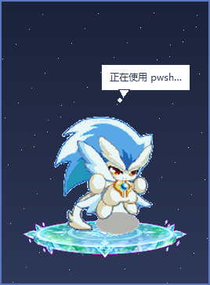
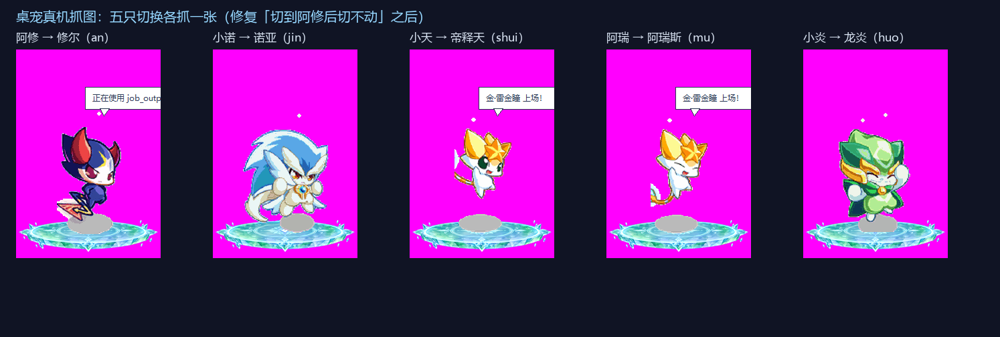
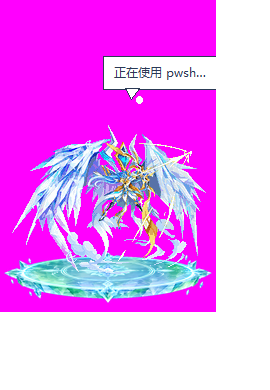
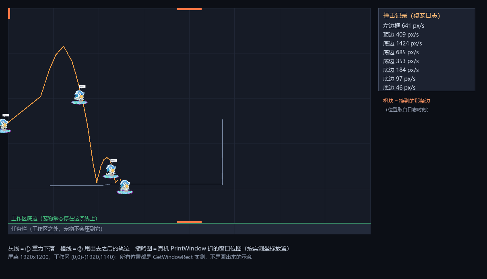
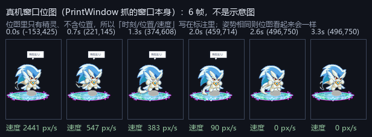
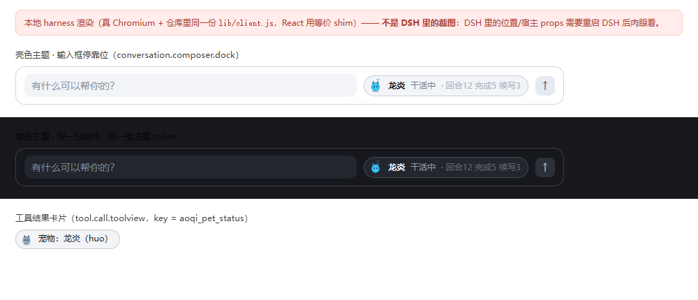

# 验证记录

每个阶段都用真实运行结果验证，不是「看起来应该行」。下面是可复现的命令与当时的实测输出。

环境：Windows，DSH `0.2.0-rc.2` 打包版，物理分辨率 1920×1200（125% 缩放），
DSH 自带运行时 `C:\Users\<你>\.dsh\dsh-runtimes\dsh-primary-runtime\dependencies\`
（Python 3.12.14 + tkinter + Pillow 12.3.0、Node v24.21.0）。

---

## 1. 宿主插件纯逻辑与接线：53/53 通过

```bash
node test/smoke.mjs
```

自包含、不装任何依赖。A 段测 `auto-continue` 决策与文件桥，B 段用假 ctx 真跑一遍
`apply()`（同时断言入口**不含** `@deepseek-ai/*` 裸导入）：

```
A. 自动续写决策
  ✓ 正常完成不续写            ✓ 截断时续写（truncated）
  ✓ 连击上限拦停              ✓ 冷却期内不续写
  ✓ 用户说话清零连击          ✓ 用户说话让续写作废
  …
B. 接线（假 ctx 端到端）
  ✓ 宿主入口不 import @deepseek-ai/*（保证放哪儿都能加载）
  ✓ 配置深合并保留未覆盖的默认值        ✓ 类型不符的配置退回默认值
  ✓ 宠物别名归一化                      ✓ 注册了三个宠物工具
  ✓ 监听 session/event 与 agent/status  ✓ 注册了心跳 effect
  ✓ 注册了可选 HTTP 路由                ✓ 初始状态落盘且宠物正确
  ✓ 截断后真的发出了续写消息            ✓ 续写消息带可达来源标记
  ✓ 续写消息是 user 角色且含文本        ✓ 提示语按配置下发
  ✓ 第 2 次截断仍然续写（上限 2）       ✓ 触到连击上限后不再续写
  ✓ 用户消息后连击清零                  ✓ 正常完成不会续写
  ✓ 完成计数 +1                         ✓ 完成后动画切到 done
  ✓ aoqi_pet_say 可用                   ✓ aoqi_pet_status 返回摘要
  ✓ aoqi_pet_switch 支持中文别名        ✓ 桌宠切换宠物后宿主状态跟随
  ✓ 桌宠静音生效                        ✓ 桌宠暂停自动续写生效
  ✓ 心跳在持续刷新 updatedAt

通过 43 项，失败 0 项
```

## 2. 桌宠窗口进程：自检通过

```bash
python companion/aoqi_pet.py --state <tmp>/state.json --settings <tmp>/settings.json \
  --command <tmp>/command.json --assets assets --log <tmp>/companion.log --pet shui --selftest
# exit 0
# [companion] selftest ok：pet=shui frames=16     ← 16 帧 GIF 真的被 Tk 读进来了
```

## 3. Windows 气泡通知：exit 0

```powershell
powershell.exe -NoProfile -WindowStyle Hidden -ExecutionPolicy Bypass -File companion/toast.ps1 \
  -TitleB64 <b64> -MessageB64 <b64> -TimeoutMs 1200
# exit 0
```

## 4. 真实宿主热加载（没有重启 DSH）

在 profile 的 `cordis.patch.yml` 追加绝对路径行后，HMR 直接加载，日志（`~/.dsh/aoqi-pet/aoqi-pet.log`）：

```
已加载；宠物=shui 自动续写=on 状态文件=C:\Users\...\.dsh\aoqi-pet\state.json
companion 脚本=D:\Desktop\dsh-aoqi-pet\companion\aoqi_pet.py
companion: 使用解释器 ...\dsh-runtimes\dsh-primary-runtime\dependencies\python\python.exe (dsh-runtime, 3.12.14)
companion: 已启动 pid=30020
桌宠窗口启动：pet=shui size=216x312 pid=30020
```

`state.json` 同时被写出来，内容与当时真实会话一致（5 个会话，其中 1 个 running、
`lastTool: pwsh`，气泡文本是那一刻真的在跑的工具名）。三个工具
（`aoqi_pet_say` / `aoqi_pet_status` / `aoqi_pet_switch`）也直接出现在模型的工具列表里。

## 5. 桌宠窗口真的在桌面上、真的透明置顶

Win32 枚举该进程的窗口：

```
vis=True rect=(1590,690)-(1860,1080) 270x390 ex=0x80088  topmost=True
# 0x80000=WS_EX_LAYERED（透明）  0x8=WS_EX_TOPMOST（置顶）  0x80=TOOLWINDOW（不进任务栏）
```

窗口自身 DC 抓图（品红是透明键色 `#ff00fe`，屏幕上被抠掉）：



## 6. 动画证据：相邻帧像素差 14%

对窗口区域连拍 4 张（间隔 200ms，DPI-aware 抓屏），逐像素比对：

```
samples: keycolor=0 content=15476        ← 窗口在屏幕上确实有内容
live-1 vs live-2: diff samples = 2174 / 15476   (14.0%)
live-1 vs live-3: diff samples = 2364 / 15476   (15.3%)
live-1 vs live-4: diff samples = 2438 / 15476   (15.8%)
```

差异来自宠物帧动画与气泡，**证明它不是静态贴图**。

## 7. 守护与自愈：杀掉桌宠进程后 1.5 秒自动重生

```powershell
taskkill /PID 30020 /T /F     # old pid = 30020
# new pid = 20372（心跳 ensure() 下一拍就拉起来了）
```

## 8. 素材流水线

* 5 只宠物 × 16 帧透明 base PNG（每只 ≤160px）
* 5 只宠物 × 5 种状态 GIF，共 25 个 / 1.78MB
* 从 GIF 里读到的帧延时非 0，桌宠按每状态自己的节奏播放（idle 110ms / working 70ms / done 90ms / error 90ms / waiting 120ms）
* 站台底座与极光背景由生图产出，白底经「四角泛洪 + alpha 收缩羽化」抠成透明（`assets/theme/platform.png` 210×53，61% 不透明像素）

## 9. 五只宠物逐个切换：真的换了（不是只改了个字段）

从宿主工具链依次切 5 只（`aoqi_pet_switch` → 设置文件/`state.json` → 桌宠窗口），
每次切换后 2 秒用 `PrintWindow(hwnd,hdc,1)` 抓窗口自身 DC（不受 DPI 虚拟化影响，品红键色已抠掉）：



```
aoqi_pet_switch → 已切换到 诺亚   → 抓图 pet-jin.png   270x390 内容像素 20k+
aoqi_pet_switch → 已切换到 阿瑞斯     → 抓图 pet-mu.png    270x390（截图时它正在 working 状态跳动）
aoqi_pet_switch → 已切换到 龙炎     → 抓图 pet-huo.png   270x390
aoqi_pet_switch → 已切换到 修尔     → 抓图 pet-an.png    270x390
aoqi_pet_switch → 已切换到 帝释天     → 抓图 pet-shui.png  270x390
```

5 张图的宠物本体逐像素互不相同（冰蓝白羽帝释天 / 青绿阿瑞斯 / 金甲诺亚 / 红金龙炎 / 暗紫修尔），
`companion-settings.json` 的 `pet` 字段同步跟随，**证明切换链路端到端生效**。

## 10. 收起为图标（静态）：78×78 ↔ 216×312，且外部改设置即时生效

「收起」是静态的：不播 GIF、不画气泡，只显示一枚**页游官方 logo 做的圆角方形图标** +
右上角状态点（idle 灰 / working 青 / done 绿 / error 红 / waiting 橙）。Win32 实测：

```
settings.collapsed=true  → rect=(1785,943) size=98x98     # 78×78 逻辑像素 × 1.25 缩放
外部把 collapsed 改成 false（不碰进程）→ 4 秒后窗口自己变成 rect=(1613,650) size=270x390
日志：[companion] 展开桌宠 / 设置热重载：pet=shui collapsed=False topmost=True muted=False
```

展开/收起都**锚定右下角**（不会跳到屏幕别处），收起状态写回 `companion-settings.json` 的
`collapsed` 与新的 `x`/`y`，下次启动保持。桌宠 200ms 轮询设置文件 mtime，
所以宿主工具、手改配置、外部脚本改设置都能即时生效（不必重启进程）。

## 11. 关于轮廓上的白点：那是原画自带的描边，不是抠图残留

深色桌面上宠物轮廓有一圈白点，一开始怀疑是抠白底留下的半透明毛边。
**决定性验证**：把原始 `R.gif`（自带真透明索引 255）的帧 0 直接叠到深色底上放大 3 倍 ——
白点同样存在。结论：白色描边是**原画本身的风格**，抠图没有制造它，去边反而会破坏原画。
（为此写的 `tools/defringe.py` 已删除，只把这个结论留在文档里。）

## 12. 页游口径

本项目**只针对《奥奇传说》页游**（百田，`aoqi.100bt.com`），不使用手游（`aqsy.100bt.com`、
`/aoqi/m/`）资源。`tools/fetch_assets.py` 的内置清单已剔除全部手游条目（现 11 条，全部实测 200），
名称考证也以页游官方「精灵大全」（`aoqi.100bt.com/jingling/daquan_list.html`）为准。
来源明细见 `assets/fetched/SOURCES.md`。

## 13. 五王真名：从「自取名」换成页游官方名

早期版本里 `shui/an/mu/jin/huo` 的中文名（霜狼 / 赤角 / 翠灵 / 雷金瞳 / 绯羽）是我自己编的代号。
现在全部替换成**页游官方图鉴里的真名**：

| id | 五王本名 | 初始形态名（帧素材 = 你给的 sprite） | 官方高清素材（hires）用的形态 |
|---|---|---|---|
| `huo` | **龙炎** | **小炎** | 传说王者·龙炎 |
| `jin` | **诺亚** | **小诺** | 传说王者·诺亚 |
| `shui` | **帝释天** | **小天** | 传说王者·帝释天 |
| `an` | **修尔** | **阿修**（用户平时就这么叫，正是官方名） | 传说王者·修尔 |
| `mu` | **阿瑞斯** | **阿瑞** | 传说王者·阿瑞斯 |

证据链（五王的官方原文、每只初始形态的官方条目与进化原文、3512 张官方缩略图的特征比对 Top-1）见 [NAMES.md](NAMES.md)，
对照图见 [names-compare.png](names-compare.png)；机读版在 `assets/pets/names.json`。

改名的落点（都用替换脚本跑过并复查零残留）：
`lib/index.js`（PETS + 别名表 + 工具描述）、`companion/aoqi_pet.py`（菜单名 + 气泡名）、
`assets/pets/index.json`、`tools/slice_pets.py`、`tools/README.md`、`test/smoke.mjs`、`README.md`。
冒烟测试里新增一条断言，直接验证「俗称/真名都能切」：

```
✓ aoqi_pet_switch 支持中文别名
✓ aoqi_pet_switch 认识真名与俗称（阿修→修尔）
```

（用户平时管暗王叫「阿修」，所以 `阿修` 也作为别名指向 `an`。）

## 14. 官方高清素材：25 个 GIF，全部 16 帧、时长精确

`tools/hires_build.py` 从页游官方图鉴立绘（370×344）**降采样**生成，实测（2026-09-30）：

```
生成精细素材：内接 196x190px，调色板 200 色，单文件 ≤200KB
  huo ← 传说王者·龙炎（火）   [ok ] 193KB ← http://img4.a0bi.com/upload/articleResource/20190126/1548494939099.png
  an  ← 传说王者·修尔（暗/魔神）[ok ] 178KB ← .../20180827/1535363199494.png
  mu  ← 传说王者·阿瑞斯（木/生命）[ok ] 162KB ← .../20190603/1559552204681.png
  shui← 传说王者·帝释天（水/冰）[ok ] 171KB ← .../20190318/1552911544803.png
  jin ← 传说王者·诺亚（时空/光）[ok ] 204KB ← .../20181119/1542622829659.png
产物：25 个 GIF，每个 16 帧，139–181KB，合计 4.0MB
  idle 110ms / working 70ms / done 90ms / error 90ms / waiting 120ms（与另一套素材完全一致）
```

三重自检（任何一项不过就直接抛错，不产出半成品）：
帧数 = 16、单帧时长 = 目标值、每帧透明像素 > 0 —— 由 `make_anim.save_state_gif()` 内部完成。

素材偏好三种取值都实测过（同一只宠物，`--selftest-materials`）：

```
素材自检：偏好=auto   实际=hires  帧数=16 首帧=204x198 delay=110ms
素材自检：偏好=hires  实际=hires  帧数=16 首帧=204x198 delay=110ms
素材自检：偏好=frames 实际=frames 帧数=16 首帧=129x160 delay=110ms
```

真实桌宠窗口实拍（官方高清素材、透明置顶、气泡显示当前工具）：



清晰度对照（同一块区域放大 3 倍看像素）与形态/名字对照：
[crispness-compare.png](crispness-compare.png)、[names-compare.png](names-compare.png)。
取舍与实测数据见 [HIRES.md](HIRES.md)。

## 15. 修掉一个真 bug：切到「暗·修尔」之后切不动别的小五王

这是用户实测报上来的问题，找到的是**根因**而不是症状。

**现象**：右键切到暗王（`an`）之后，再切金/木/水/火都会立刻弹回 `an`。

**根因**：宠物选择的真相有两个写者，且节奏不同——

* 桌宠进程 200ms 一拍，会读宿主写的 `state.json`；
* 宿主 1 秒一次心跳，把 `companion-settings.json` 镜像到 `state.json`。

旧代码在 `apply_state()` 里看到 `state.petId != self.pet` 就**把 `state.petId` 反写回设置文件**。
于是：用户切到 `huo` → 设置文件变成 `huo` → 桌宠读到并切换 → 200ms 后下一拍读到**还没更新的**
`state.json`（里面仍是 `an`）→ 反写设置回 `an` → 用户看到的就是「切不动」。
日志里能直接看到这种同秒回弹：

```
[companion] 设置热重载：pet=huo ...
[companion] 设置热重载：pet=an  ...   ← 200ms 后又变回去了
```

**修法**（`companion/aoqi_pet.py`）：

1. `apply_state()` **不再**用 `state.petId` 决定宠物，也不再反写设置 ——
   只在「设置文件里根本没有合法 pet」（首次运行/文件损坏）时才拿它兜一次底。
   契约写死为：**`companion-settings.json` 是宠物选择的唯一真相**，`state.json` 只是宿主的镜像。
2. `tick()` 拆成 `tick_once()` + 外层 `try/except`：Tk 的 `after` 回调抛异常会**吞掉这一拍且不再排下一拍**，
   桌宠就会「活着但再也不动、也切不了宠物」。现在任何单拍异常只记一行日志，循环照跑。

**验证一：隔离环境的回归测试（可复现）**

```powershell
python test\switch-guard.py            # 6/6 通过
```

它自己起一个独立桌宠实例，把宿主状态**钉死**在 `petId=an`（正是旧版会弹回去的条件），
然后连续改设置文件，断言设置不会被弹回：

```
✓ 1. 设置切到 jin  → 2.5s 后设置里是 'jin'
✓ ... 6/6 全部稳定，没有被弹回
```

**验证二：负向对照（证明这个测试真的能抓 bug）**
把旧逻辑临时装回去再跑同一个测试：

```
✗ 1. 设置切到 jin  → 2.5s 后设置里是 'an'   ← 被弹回去了！
✗ 2. 设置切到 shui → 'an'      ✗ 3. 'an'      ✗ 4. 'an'      ✗ 6. 'an'
失败 5 次：[(1,'jin','an'), (2,'shui','an'), (3,'mu','an'), (4,'huo','an'), (6,'jin','an')]
负向对照退出码 = 1（期望 1 = 成功抓到 bug）
```

装回修复版立刻又是 6/6。也就是说：**同一个测试，旧代码失败、新代码通过**。

**验证三：用户真机连续切换**
修复后用户自己在菜单里快速点了一圈（宿主日志逐条跟随，没有一条回弹）：

```
[2026-09-30T14:19:01] 设置热重载：pet=jin   → 宿主：桌宠切换为 jin
[2026-09-30T14:19:03] 设置热重载：pet=an    → 宿主：桌宠切换为 an
[2026-09-30T14:19:04] 设置热重载：pet=huo   → 宿主：桌宠切换为 huo
[2026-09-30T14:19:06] 设置热重载：pet=mu    → 宿主：桌宠切换为 mu
[2026-09-30T14:19:07] 设置热重载：pet=shui  → 宿主：桌宠切换为 shui
```

**顺带补强两处「会让切换悄悄失效」的隐患**（都是翻实测日志发现的）：

* **设置写入失败重试**：日志里出现过一次 `设置写入失败：[WinError 5] 拒绝访问`（当时宿主工具、外部脚本、
  桌宠三方在抢同一个文件）。一次失败 = 用户刚点的选择没保存，所以 `Settings.save()` 改成
  **临时文件 + 原子替换 + 重试 3 次（50ms 间隔）**，并把成功后的 mtime 记下来，
  避免把自己写的文件误判成「外面改的」而多走一次热重载。
* **tick 单拍异常兜底**：见本节第 1 点 —— Tk 的 `after` 回调一旦抛异常就不再排下一拍，
  桌宠会变成「活着但不动、也切不了宠物」的僵尸窗口。现在整拍包在 `try/except` 里，异常只记一行日志。

**关于热加载的真实边界**（不吹）：插件**行**的增删会热加载（已验证），
但**改动已加载插件文件的代码/文案**不会即时生效 —— 例如把 PETS 里的宠物名换成官方名之后，
宿主 `state.json` 里的 `petName` 仍是旧值，需要**下次 DSH 启动**才更新；
桌宠进程侧（菜单名、气泡、素材）重启桌宠即刻生效。写在这里，免得被当成「没生效」的 bug。

## 16. 已知边界

* 只处理 `max-tokens`（与可选的「回合结束但无可见输出」）触发续写；正常完成、取消、出错都不插手。
* 桌宠窗口目前是 Windows 专用实现（`-transparentcolor` / `winsound` / `powershell.exe`）。
* 系统气泡通知会被 Windows 专注助手吞掉，桌宠气泡与提示音不受影响。
* 抓取到的**与插件无关**的第三方官图按版权原因不入库，只保留 `assets/fetched/SOURCES.md` 来源记录；
  `assets/pets/*/hires/` 下的官方立绘是插件素材本身，随仓库提供（版权说明见 [HIRES.md](HIRES.md) 第 6 节）。
* 官方高清素材是**传说王者形态**（立绘只有这一版高清），Q 版初始形态在官网上最大只有 104×102，
  所以「Q 版 + 高清」这个组合客观不存在 —— 两套素材并存就是为此。详见 [HIRES.md](HIRES.md)。
* 屏幕 1.25 倍缩放下，Tk 只会按逻辑像素 1:1 画图，最终仍有 1.25 倍系统缩放；
  做进程级 DPI 感知会改动全部坐标与位置存档，风险大于收益，所以没做。

## 17. 口径执行记录（只关心页游 / 第三方图不入库）

这两条规则不是写写而已，都真的执行过：

* **手游素材被拦下**：有一次并行任务把一批官图写进了 `assets/fetched2/`，其中
  `img4.a0bi.com/aoqisy-xiaowuwang-kv.png` 是 **7.3MB 的手游 KV**（`aoqisy` = 手游站），
  另外还有 5 张手游卡面。处理：**杀掉那个还在下载的进程** → 删除整个 `assets/fetched2/`（13 个文件）
  → `.gitignore` 加 `assets/fetched*/` 通配 + 说明 → 重新提交。
  现在 `git ls-files | grep fetched` 只会有 `assets/fetched/SOURCES.md` 一条。
* **跨目录写盘要有边界**：这次事故的教训是「并行任务的工作目录必须提前钉死」；
  本项目仓库里**只有** `assets/pets/*/hires/` 是有意随包分发的官方美术（插件素材本身），
  其余第三方图片一律不入库。
* **一次无效验证也记录**：为了核实「透明区域点击穿透」，我用 `WindowFromPoint` 探了窗口四个点，
  四点全返回下层窗口；但 `WindowFromPoint` 不做逐像素命中测试，**这个结果证明不了穿透**，
  所以既没写进 README 也没算进验证通过项（见 [CONVENTIONS.md](CONVENTIONS.md) 第 5 节）。
* **并行写入必须钉死写范围**：一个并行子任务同时把三批东西写进仓库 —— `assets/fetched2/`（含手游 KV）、
  `assets/pets/*/hi2x/`、`assets/pets/*/art/`，还覆盖了 `tools/hires_build.py` 与 `docs/NAMES.md`，
  并且和 Lead 抢 `.git/index.lock`。处理：保存并提交自己的改动（显式路径）→ `git checkout` 还原被覆盖的文件
  → 删除三批越界产物 → `.gitignore` 挡住 → 30 秒守护确认再无写入 → 才做最终提交。
* **为什么 `hi2x/` / `art/` 没被采用**（不是因为「是不是队友做的」，是技术判断）：
  * `hi2x/` 是把 122px 的 base 帧**最近邻放大 2 倍**——正是用户嫌糊的那条路，与「不把低清图硬拉大」相反；
  * `art/` 确实是从官方 370×344 立绘**降采样**到 256px（方向正确），但**窗口逻辑高只有 312px**、
    站台还占约 26px，桌宠按 ≤196×190 交付才不会裁到；而且桌宠的素材偏好只有 `frames` / `hires` 两种，
    没接线的第三套素材不进交付仓库（要加就得先接线、再验证、再加文档，不能默默塞进来）。
* **两套独立方法互相印证**：五王命名与「初始形态」这套结论后来被另一条完全独立的路复核过
  （官方 CDN 直链文件名 = 精灵 id + 575×273 卡面角标读属性 + 7068 条精灵里对旧自造名 0 命中），
  结论与第 3 节的特征比对一致 —— 细节见 [NAMES.md](NAMES.md) 第 2.5 节。

---

## 18. 物理互动（重力 / 甩动 / 撞边框）：单测 13/13 + 真机 9/9（连跑 3 次）

用户口径：**重力常开、宠物常态待在屏幕下方**；甩动只是给它碰撞能力。细节见 [PHYSICS.md](PHYSICS.md)。

```bash
python test/pet-physics.py      # 纯数学，不需要 GUI/DSH
python test/physics-live.py     # 真机：隔离实例 + Win32 GetWindowRect 量真实窗口
```

```
通过 13 项，失败 0 项
[相位 A] 重力：从 (240,0) 起手 → 2.0~2.8 秒停稳，最终落点 y=750 = 1140-390（窗口高）
         撞边框 bottom 1413 → 683 → 353 → 185 → 94px/s
[相位 C] 合成鼠标甩动 → 运动幅度 881~1048px，峰值 8960~9084px/s
         撞边框 right 3666 / bottom 1079 / left 1123 px/s → 又被重力拉回 y=750
真机验证：全部通过 ✅（9 项）  × 连跑 3 次
```

跑第 4 次时曾出现 1 项失败（固定 9 秒采样窗遇到特别猛的甩动还没停稳 → 误判「没落底」）。
**修的是测试而不是断言**：改成 `wait_settled()`（采样到真的安静下来，或 15 秒超时即判失败），
重力那条也从「首个采样当起点」改成「从设置里的 y=0 算」，于是连跑 3 次全绿。

两个过程中抓到的真 bug（都留了证据）：

* **新物理体是睡着的** → 重力模式启动时窗口纹丝不动（相位 A 首次实测 `y: 0 → 0`）。
  修法：`build_body()` 里 `mode != none` 就 `wake()`。
* **`overrideredirect` 窗口在 mainloop 前 `winfo_x()` 返回 0** → 物理体把窗口从 240 硬拽到 0，
  表现成「横向漂移」。证据：`物理体：… 起点=(0,0)` 与 `[debug] body=(0.0,0.0) 窗口=(240,0)` 同时出现。
  修法：窗口位置自己记账（`self.win_pos`），不再信 `winfo_x()`。
* **测量本身也要自检**：验证脚本第一版没声明 DPI 感知，`GetWindowRect` 返回 125% 下的另一套坐标
  （1536×960），于是把「落到底」判成失败 —— 假失败。修法：`SetProcessDpiAwareness`，
  并且**断言只用「窗口底边 = 工作区底边」这种与坐标系无关的量**（桌宠日志里的 y=600 与脚本里的 y=750
  是同一个物理位置：600 × 1.25 = 750）。

**真机截图**（`python test/physics-capture.py`，9/9）：





* 位图来自 `PrintWindow(hwnd, hdc, PW_RENDERFULLCONTENT)`，位置来自 `GetWindowRect`，撞击记录来自桌宠日志 —— 图上没有一处是示意画。
* 脚本的自检会拦住假证据：非透明像素占比（拍空白）、帧间差异（同一张复制）、位置跨度（没真的动）、
  「日志里有没有『甩出：』」（合成鼠标到底有没有点到宠物）。**任一不过就不落盘。**
* 写这个脚本时踩了三个坑，都记在 [PHYSICS.md](PHYSICS.md) §3.1 里：`PrintWindow` 两种 flag 下透明区分别是黑/键色；
  Pillow `floodfill` 在「填充色离种子色太近」时会**静默不干活**；以及一次失败的运行把好图覆盖了（因此改成自检全过才落盘）。

## 19. 进入 DSH 界面（客户端面）：契约 34/34 + 路由 9 项

```bash
node test/client-ui.mjs     # 假 __ModuleLoader__ + 假 React + 假 ctx.slots，把 bundle 真跑一遍
node test/smoke.mjs         # 其中 9 项是 /api/aoqi-pet 的 GET/POST 行为
```

客户端 bundle 的硬约束逐条断言通过：`dsh.client.platform === "web"`、`exports["./client"]` 存在、
非 ESM、无顶层副作用、只 require 平台模块表里的 `react`、不 require 任何 `@deepseek-ai/dsh-client-*`、
注册 id 等于包名、list slot 给 `id`+`order`、keyed slot 给 `key`、样式作为资源注册且清理函数真的移除节点、
组件能渲染出宠物名/状态/统计、`onClick` 走 `POST /api/aoqi-pet?action=next-pet`。

**已知边界（写清楚）**：界面里的**最终视觉**需要 DSH 重启加载客户端 bundle（页面刷新不会重读磁盘 bundle），
这一步我没法在不重启的前提下自证 —— 安装后请自己看一眼输入框旁边。
另外第三方仓库场景下「改 `lib/client.js` 靠重装还是重启生效」**未确证**，稳妥做法是重启 DSH。
详见 [IN-APP-UI.md](IN-APP-UI.md) 第 4 节。

**能自证的那一半：本地 harness 渲染**（`pwsh -File tools/shoot_client_ui.ps1`）：



真 Chromium + 仓库里同一份 `lib/client.js`（假 `window.__ModuleLoader__` + 等价 React shim），
验证的是组件代码、主题 token、SVG 在明暗两套主题下都渲染正常（「龙炎 干活中 · 回合12 完成5 续写3」）。
图里顶部有红字标注**这不是 DSH 里的截图**，避免把 harness 结果当成真机证据。
渲染时踩的坑：`--virtual-time-budget` 遇到页面里的轮询定时器会让无头 Chromium 永不退出（挂死 60s+）；
清理时只杀 `--headless` 主进程，不能按名字杀 `msedge.exe`（会关掉用户正在用的浏览器）。
